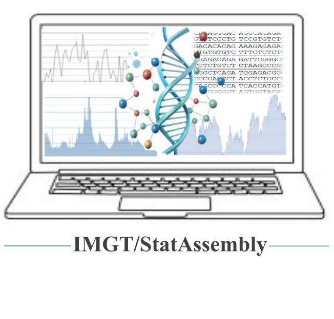

# IMGT/StatAssembly

[](https://zenodo.org/doi/10.5281/zenodo.15016809)


IMGT/StatAssembly uses BAM files to assess the quality of the IG/TR loci in assemblies and to validate new alleles.

## Software information

It is a script written in Rust, compiled as an optimized binary or an AppImage.

The script was made by [IMGT&reg; team](https://www.imgt.org#universe) and is part of [IMGT&reg; rules](#results-analysis) to assess the quality of loci, genes and alleles.

<p float="center">
  
   
</p>

## How to install

You can use the AppImage, the binary or compile from source code.

### Binaries and AppImage

Download the binaries or the AppImage from binaries folder or releases depending on your OS and put it in your path. Then type:

```bash
IMGT_StatAssembly -h
```

to access the help and all parameters.

### Source code

- [ ] Install [rust](https://www.rust-lang.org/fr/learn/get-started) if not installed.
- [ ] Check Rust version `rustc -V`, should be >= 1.93.
- [ ] Do a `git clone` of the repo and then `cargo build --release` to compile the software or run to run.

Those commands can be put as:

```bash
git clone https://src.koda.cnrs.fr/imgt-igh/statassembly.git
cd statassembly
cargo run --release
```

## Execution  (Test)

Here is the command to execute with example files from the repository folder on linux 64bits:

```bash
binaries/IMGT_StatAssembly_linux_x64_86 --totalread --extractedlength 4772468 -a example_files/assembly.fasta -f example_files/CHM13v2.0.bam -s human -l example_files/CHM13v2.0loc.csv -g example_files/CHM13v2.0geneloc.csv -o results/ full
```

The list of arguments used in the example (more available in software help):

* ```-f``` is the BAM file with its index (in the same folder) (see [BAM file generation](##generation-of-a-bam-file))
* ```-s``` is the species
* --totalread to get read mismatch rate
* ```-l``` is the locus file (see [input file section](#script-input-files-and-data))
* ```--extractedlength``` is the length of the extracted assembly from the BAM file if it is partial/truncated, else it is automatically calculated.
* ```-g``` is the gene list file (see [input file section](#script-input-files-and-data))
* ```-o``` is the path of the folder to put results (would be created if not existing and overwritten if existing)

The script should last around 30 seconds.

> [!NOTE]
> To get example_files, you need to have git lfs installed and download them. More information on [Git LFS](https://git-lfs.com/).
>
> ```bash
> sudo apt install git-lfs
> git lfs install
> git lfs fetch
> ```

## Script input files and data

### Commands

The script has three different command (last argument):

- `find` allows to find the IG/TR loci and genes. The assembly (`-a`) must be provided.
- `analyze` allows the analysis of IG/TR loci and genes.
- `full` launches find command then analyze command.


### Find

By giving the assembly, you can generate the gene list and the locus position. The BAM file is not required for this part only.

```bash
binaries/IMGT_StatAssembly_linux_x64_86 --totalread --extractedlength 4772468 -a example_files/assembly.fna -s human -o results/ find
```

#### Generation of assembly index

The script will fail if the assembly is not indexed. To index it, use samtools:

```console
samtools faidx assembly.fasta
```

### Analyze 

* The BAM file (-f) from analysis and its index, the presence of a cigar with `=`/`X` (match; substitution), a MD tag or a cs tag is recommended. *Some analysis won't be available without it*. The use of HiFi reads should be preferred as short or noisy reads might give confusing results.

> [!TIP]
> If your BAM file does not contain equal CIGAR format or a CS/MD tag, you can recalculate this tag without relaunching the analysis completely if you have the bam file and the assembly like:
>
> ```console
> samtools calmd -b -@ 28 full.bam assembly.fasta > align.bam
> ```
>
> Then you can use the new BAM file to have full results in the software.

* If the find analysis is not performed. A TSV file (-l) with the following information, separated by a tabular:

```tsv
Locus Haplotype contig  start end
```

Locus must be one of the following:

* IGH
* IGK
* IGL
* TRA[^1]
* TRB
* TRG

Haplotype must be one of the following:

* Primary or pri or p (case insensitive)
* Alternate or alt or a (case insensitive)

The rest is ***case sensitive***. You can only have one alternate per primary (the line just after the primary) and as many primary as you want. Primary and Alternate are compared and shown together in graphs.

The contig name has to match reference ID, start and end should match SAM regions (1-based position). If start is greater than end, the locus would be considered reverse.
*You can use [IMGT&reg; description](https://www.imgt.org/IMGTrepertoire/LocusGenes/#h1_11) or [IMGT/LIGM-Motif](https://imgt.org/ligmotif/) to identify the locus position. if you use find analysis*.
Example in test files.

* (Optional). if the find analysis is not performed. A CSV file (-g) containing gene position on the chromosome (optional). ***Header must be preserved***, quotes are escape characters:

```csv
"gene","chromosome","strand","start","end"
"IGHA1","NC_060938.1","minus","99976277","99980553"
"IGHA2","NC_060938.1","minus","99837189","99841426"
"IGHD","NC_060938.1","minus","100108615","100117138"
```

Strand can be 0 or 1 (reverse), + or - (reverse), plus or minus (reverse). Strand is related to the chromosome.
Chromosome, start and end should be 1-based position. *Start should be less than end (else start and end are swapped)*.
Example in test files.

### Generation of a BAM file

To generate the BAM file used in the analysis, you can follow the steps given below.

> [!WARNING]
> In order to generate accurate results, use the two haplotypes of an assembly when creating the BAM file so that the reads match their correct haplotype.

<details>
<summary>Steps</summary>

***The commands (minimap2 and samtools) need a lot of memory (more than 32 Go, hundreds of Go of storage and at least 32 threads). Run it from your cluster if you have to. The script may take several hours because of the alignment.***

* Download the assembly of T2T-CHM13v2.0 from [NCBI website](https://www.ncbi.nlm.nih.gov/datasets/genome/GCF_009914755.1/) named as assembly.fasta.
* Download HiFi reads of T2T-CHMv2.0 from [NCBI SRA](https://www.ncbi.nlm.nih.gov/sra/?term=SRX789768*+CHM13) and keep their SRA names. Or execute ``/bin/bash example_files/download.sh``.
* Install dependancies if not existing

```console
# apt install minimap2 samtools
```

#### Automatic

* Execute the script ``/bin/python3 example_files/assembly.py -m map-hifi -l example_files/CHM13v2.0loc.csv -g example_files/CHM13v2.0geneloc.csv -s human -o results/`` from the folder with reads and assembly.
* if you want to check the quality of your reads before using fastqc (to be installed), run this: ``/bin/python3 example_files/assembly.py -m map-hifi -q -l example_files/CHM13v2.0loc.csv -g example_files/CHM13v2.0geneloc.csv -s human -o results/``.

#### Manual

* Launch minimap from bash terminal and create the BAM file and its index:

```bash
cat SRR11292*.fastq.gz > reads.fastq.gz && rm SRR11292*.fastq.gz
minimap2 -ax map-hifi -t 32 --eqx --cs assembly.fasta reads.fastq.gz > reads.sam
samtools sort -@ 32 -o reads.bam reads.sam
samtools index -c reads.bam
```

The output of the commands should look like:

```console
[M::mm_idx_gen::42.277*1.51] collected minimizers
[M::mm_idx_gen::47.081*2.06] sorted minimizers
[M::main::47.081*2.06] loaded/built the index for 24 target sequence(s)
[M::mm_mapopt_update::50.206*1.99] mid_occ = 177
[M::mm_idx_stat] kmer size: 19; skip: 19; is_hpc: 0; #seq: 24
[M::mm_idx_stat::52.608*1.95] distinct minimizers: 215124360 (92.06% are singletons); average occurrences: 1.455; average spacing: 9.958; total length: 3117275501
[M::worker_pipeline::64.187*2.84] mapped 7641 sequences
[M::main] Version: 2.27-r1193
[M::main] CMD: minimap2 -ax map-hifi -t 32 --eqx --cs genome.fasta reads.fastq.gz
[M::main] Real time: 64.475 sec; CPU: 182.440 sec; Peak RSS: 12.281 GB
[bam_sort_core] merging from 0 files and 32 in-memory blocks...
```

The BAM file as a result is different from the BAM in example_folder as it is restricted to specific portion of the assembly but contains the same results and can be used as input file.

</details>

## Output

The expected output from execution with test files is present in `example_files/results/`.

### Description of generated file in example folder

For each assembly (in the graph named readresult.png) and for each allele (if applicable), the color of the graph would give information in the assembly and/or allele validates [IMGT&reg; criterias](#results-analysis).

> [!TIP]
> The images provided can also be created as svg file with ```--svg``` argument.
<details>
<summary>Description</summary>

- *break.txt* lists where breaks are present. Breaks represents positions where less than x reads are covering this position (default: 3, parameter: `breaks`).
- *mismatchresult.txt* shows two graphs.
  - The first graph shows the PHRED quality score (`rgb(0, 0, 0)` (black) curve) with the legend on the right axis. The rate of mismatches (`rgb(126, 87, 194)`) and misalign (`rgb(239, 83, 80)`) is also shown for each position with the legend on the left axis. A misalign is a read that has an indel at this position and a mismatch a read with a substitution.
  - The bottom graph shows the number of mismatch rate for all reads which alignment cover the position indicated (`rgb(255, 171, 145)`).
- *readresult.png* shows over the locus (position on the chromosome and on the locus displayed) the number of reads based on their quality score, as well as secondary, supplementary, mean coverage and overlapping alignments. The number of breaks and the number of reads with soft clips is displayed as red bars and black bars at the bottom panel if existing.
- *positionresult.csv* lists all the information of both graphs. However mismatches and misalign represents a number and not a rate as in the graph. The rate could be recalculated by dividing with the sum of reads in the column map60,map1 and map0.
- If gene list is provided:
  - *allele_confidence.csv*: List all suspicious (shown as ! in Excel and `rgb(239, 83, 80)` on charts) and warning positions (shown as ~ in Excel and `rgb(255, 183, 77)` on charts). By default:
    - Warning positions (`rgb(255, 183, 77)`) are positions where less than x reads (parameter: `minreads` default 10) are present and/or the rate of reads matching the base compared to the number of reads present at this position is above the suspicious position rate and below the treeshold (parameter: `percentwarning` default 0.8).
    - Suspicious positions (`rgb(239, 83, 80)`) are positions where the rate of reads matching the base compared to the number of reads present at this position is less than the treeshold (parameter: `percentalerting` default 0.6).
  - A folder `gene_primary` and/or `gene_alternate` containing a graph for each gene, with number of total reads for each position (total reads), reads without indels (sequence match) and sequence match. The number of reads that covers the entire region with 100% match are displayed with the `rgb(0, 0, 0)` (black) curve. The average ratio of soft clips is also shown (black histogram). The number of real reads based on the phred score is also shown with the `rgb(121, 85, 72)` (brown) curve. Phred score is displayed at the lower panel.
  - *geneanalysis.csv*: List all genes, their chromosome, strand, start and end. It displays the average read coverage (the ratio of the average length of the reads covering this zone compared to the length of the given region), the number of reads on this region. Then for each position, the number of reads in total with the number of reads with identical sequence (=), ones with substitutions (X) and ones with deletions (D) or insertions (I) and the ratio of reads with soft clips at that position (S). Readsfull column counts the number of reads spanning the entire region, whereas reads100 and reads100m shows respectively the number of reads matching without indels or with perfect match the full region. Realreads100m is a score of perfect match reads based on their phred score. Coveragex shows how much position are covered by at least x reads (default: 10, parameter: `coverage`).
- *newloc.csv*: contains locus information with status (Accepted/Rejected).
- *sequence.fasta.gz*: contains extracted sequence of all identified loci (compressed).
- *validatedalleles.fasta*: contains the list of all alleles (with their closest IMGT/GENE-DB match) that are validated, as well as their locus.
- **genelist_new.csv*: gives a gene list for all loci (if not provided) based on closest IMGT/GENE-DB match. It does not provide gene status which is in ```gene_analysis.csv```.

For each read matching perfectly the gene, a score is assigned. The sum is the realreads100m score. The score is rounded in the graph. This score is the average PHRED score quality of the read at the gene position:
- Phred score unknown or less than 10 gives 0,
- Phred score between 11 and 20 gives 0.1,
- Between 21 and 30 gives 0.3,
- Between 31 and 40 gives 0.7,
- Between 41 and 50 gives 0.9,
- Above 51, the score is maximal: 1.
</details>

### Results analysis

For a better overview of IMGT&reg; rules based on this analysis, check [IMGT&reg; assembly quality rules](https://imgt.org/IMGTScientificChart/Assemblies/IMGTassemblyquality.php).

> [!NOTE]
> For `readresult.png` and each allele graph, the color of the graph would indicate if the locus and/or gene meets IMGT&reg; criterias.
> - [x]  Green for validation
> - [ ]  Red for rejection
>
> Criterias are as followed:
> * For locus: Number of reads inside the window coverage (max(10,Mean coverage / 2)<Nb<Mean coverage x 2) and soft clips less than 40%. Telomeric region (10 kb) is not taken into account.
> * For genes: At least 10 matching reads and no suspicious or warning positions and soft clips less than 40%.

*The threshold can be changed for the graphs but not for the validation (and therefore the color title and csv files).*

## How to cite

If you use IMGT/StatAssembly in your work, please cite the article related to the software and the version you used:

> IMGT® at scale: FAIR, Dynamic and Automated Tools for Immune Locus Analysis
>
> Gaoussou Sanou, Guilhem Zeitoun, Taciana Manso, Milad Eidi, François Grand, Anjana Kushwaha, Myriam Croze, Chahrazed Debbagh, Axel Vaillant, Maria Georga, Ariadni Papadaki, Ifigeneia Sideri, Shamsa Batool, Turkan Samadova, Joumana Jabado-Michaloud, Géraldine Folch, Véronique Giudicelli, Patrice Duroux, Sofia Kossida
> *Nucleic Acids Research;*, gkaf1024, [https://doi.org/10.1093/nar/gkaf1024](https://doi.org/10.1093/nar/gkaf1024)

### Versioning

Version will follow SemVer [Semantic Versioning 2.0.0](https://semver.org/).

### Thanks

Thanks to [Christophe Klopp](https://www.researchgate.net/profile/Christophe-Klopp) from Sigenae - an INRAE bioinformatic platform, who give us some ideas to improve the software. Thanks to [IMGT&reg; team](https://imgt.org/#universe) for comments and feedbacks.

## License

IMGT/StatAssembly - &copy; Copyright 2025-2026. IMGT&reg;, IGH, Univ Montpellier, CNRS, Montpellier, France.
Authors: Guilhem Zeitoun and IMGT&reg; team.
The software is licensed under the [EUPL](https://interoperable-europe.ec.europa.eu/collection/eupl/eupl-text-eupl-12) (European Union Public Licence) v1.2.

The IMGT&reg; logo and the software logo remain the property of IMGT&reg; and all rights are reserved.

The [Rust crab](https://www.rustacean.net/) is under [CC0 1.0 Universal](https://creativecommons.org/publicdomain/zero/1.0/).

## Memory consumption

The script tries to use as less memory as possible. However the memory consumption depends on the use of rmmap and BLAST and if locus and gene position were provided. Here is a memory graph for example file when locus and genes are provided, it does not count BLAST memory consumption:

And when there are not provided (arg ```--lowmemory``` set):


[^1]: TRD is inside TRA locus and so both loci are analyzed together.
