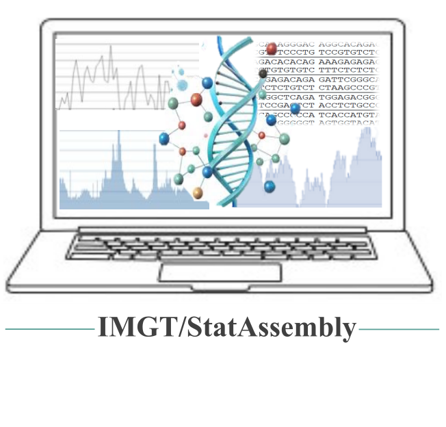

# IMGT/StatAssembly


IMGT/StatAssembly uses BAM file to assess the quality of the assembly, including order of genes and validation of alleles in IG and TR loci. 
<p align="middle">

</p>

## Source
It is a script written in Rust, compiled as a optimized binary.
<p align="middle">

</p>
The script was made by <a href="//www.imgt.org">IMGT team</a>.
<p align="middle">

</p>

## Script input files and data
* The BAM file from analysis and its index, the presence of a cigar with `=`/`X` (match; substitution), a MD tag or a cs tag is recommended. *Some analysis won't be available without*.
* A CSV file with the following information, separated by a tabular:
```
Locus Haplotype contig  start end
```
Locus must be one of the following:
* IGH
* IGK
* IGL
* TRA[^1]
* TRB
* TRG

[^1]: TRD is inside TRA locus and so both loci are analyzed together.

Haplotype must be one of the following:
* Primary or pri or p (case insensitive)
* Alternate or alt or a (case insensitive)

The rest is ***case sensitive***. You can only have one alternate per primary (the line just after the primary) and as many primary as you want. Primary and Alternate are compared in graph.

Contig, start and end should match SAM regions. If start is greater than end, the locus would be considered reverse.
Example in test files.

## How to install

### Binaries

Download the binaries from binaries folder depending on your OS. Then type:
```bash
IMGT_StatAssembly -h
```
to access the help.

### Source code

- [ ] Install rust if not installed.
- [ ] Check Rust version, should be >= 1.85.
- [ ] Do a git clone and then `cargo build --release` to compile the software.

## Execution (Test)

Here is the command to execute with example files from the repo folder on linux 64bits:
```bash
binaries/IMGT_StatAssembly_linux_x64_86 -f example_files/CHM13v2.0.bam -s human -l example_files/CHM13v2.0loc.csv -g example_files/CHM13v2.0geneloc.csv -o results/
```

## Output

The expected output from execution is present in `example_files/results/`.

### Description of generated file in example folder

- *break.txt* lists where breaks are present (default: 3,parameter: breaks). An empty file means no break.
- *mismatchresult.txt* shows two graphs.
    - The first graph shows the PHRED quality score (`rgb(0,0,0)` (black) curve) with the right axis. The rate of mismatches (`rgb(126,87,194)`) and misalign (`rgb(239,83,80)`) is also shown for each position. A misalign is a read that has an indel at this position and a mismatch a read with a substitution.
    - The bottom graph shows the number of mismatch rate for all reads overlapping the position indicated (`rgb(255, 171, 145)`).
- *readresult.png* shows over the locus (position on the chromosome and on the locus displayed) the number of reads based on their quality score, as well as secondary, supplementary and overlapping reads. The number of breaks is displayed as red bars at the bottom panel if existing.
- *positionresult.csv* lists all the information of both graphs. However mismatches and misalign represents a number and not a rate as in the graph.
- If gene list given:
    - *allele_confidence.csv*: List all suspicious (shown as ! in Excel and `rgb(239,83,80)` on charts) and warning positions (shown as ~ in Excel and `rgb(255, 183, 77)` on charts).
    - A folder containing a graph for each gene, with number of total reads for each position (total reads), reads without indels (sequence match) and sequence match. The number of reads on the entire region with 100% match are displayed with the `rgb(0,0,0)` (black) curve.
    - *geneanalysis.csv*: List all genes, their chromosome, strand, start and end. It displays the average read coverage (how many times larger the reads are compared to the length of the given region), the number of reads on this region. Then for each position, the number of reads in total with the number of reads with identical sequence (=), ones with substitutions (X) and ones with indels (ID). Readsfull counts the number of reads spanning the entire region, whereas reads100 and reads100m shows respectively the number of reads matching without indels or with perfect match the full region. Coveragex shows how much position are covered by at least x reads (default: 10, parameter: coverage).

### Results analysis

For a better overview of IMGT rules based on this result, check [IMGT assembly quality rules](https://imgt.org/IMGTScientificChart/Assemblies/IMGTassemblyquality.php).

## How to cite

If you use IMGT/StatAssembly in your work, please cite:

> Institut de Génétique Humaine. (2025). IMGT StatAssembly (v0.1.4). Zenodo. https://doi.org/10.5281/zenodo.15016810

## Memory consumption
The script uses hundreds of Mo up to some Gb for a several Mo locus. Some Gb of memory should be reserved depending on the BAM file.
